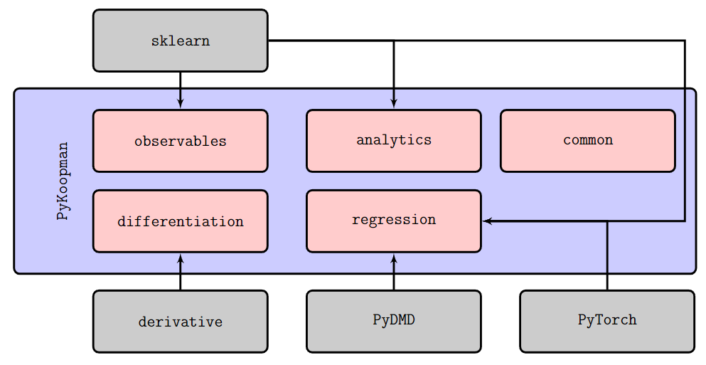

# Summary

`PyKoopman` is a Python package for the data-driven approximation of the Koopman operator associated with a dynamical systems. The Koopman operator is a principled linear embedding of nonlinear dynamics and facilitates the prediction, estimation, and control of strongly nonlinear dynamics using linear systems theory. In particular, `PyKoopman` provides tools for data-driven system identification for unforced and actuated systems that build on the equation-free dynamic mode decomposition (DMD) [@schmid2010jfm] and its variants [@Kutz2016book;@schmid2022dynamic;@brunton2022modern]. In this work, we provide a brief description of the mathematical underpinnings of the Koopman operator, an overview and demonstration of the features implemented in `PyKoopman` (with code examples), practical advice for users, and a list of potential extensions to `PyKoopman`.  Software is available at \url{https://github.com/dynamicslab/pyKoopman}.

# Statement of need

Engineers have long relied on linearization to bridge the gap between simplified, descriptions where powerful analytical tools exist, and the intricate complexities of nonlinear dynamics where analytical solutions are elusive [@ljung2010arc;@wright1999numerical]. Local linearization, implemented via first-order Taylor series approximation, has been widely used in system identification [@ljung2010arc], optimization [@wright1999numerical], and many other fields to make problems tractable.
However, many real-world systems are fundamentally nonlinear and require solutions outside of the local neighborhood where linearization is valid. Rapid progress in machine learning and big data methods are driving advances in the data-driven modeling of such nonlinear systems in science and engineering [@Brunton2019book].

In the diverse landscape of data-driven modeling approaches, Koopman operator theory has received considerable attention in recent years [@Budivsic2012chaos;@Mezic2013arfm;@Williams2015jnls;@klus2017data;@Li2017chaos;@Brunton2017natcomm]. The main idea is illustrated in Fig. \ref{fig:LinearizingTransformation}.
This methodology enables the application of closed-form, convergence-guaranteed methods from linear system theory to general nonlinear dynamics. To fully leverage the potential of data-driven Koopman theory across a diverse range of scientific and engineering disciplines, it is critical to have a central toolkit to automate state-of-the-art Koopman operator algorithms.


<!-- As shown in Fig. \ref{fig:LinearizingTransformation}, Koopman operator theory in particular is a principled approach to embed nonlinear dynamics in a linear framework that goes beyond simple linearization [@brunton2022modern]. -->

{ width=90% }


<!-- These strategies encompass not only linear methodologies [@Nelles2013book;@ljung2010arc] and dynamic mode decomposition (DMD) [@schmid2010jfm;@rowley2009spectral;@Kutz2016book], but also more advanced techniques such as nonlinear autoregressive algorithms [@Akaike1969annals;@Billings2013book], neural networks [@long2017pde;@yang2020physics;@Wehmeyer2018jcp;@Mardt2018natcomm;@vlachas2018data;@pathak2018model;@lu2019deepxde;@Raissi2019jcp;@Champion2019pnas;@raissi2020science], Gaussian process regression [@raissi2017parametric], operator inference, and reduced-order modeling [@Benner2015siamreview,@peherstorfer2016data,@qian2020lift], among others [@Giannakis2012pnas;@Yair2017pnas;@bongard_automated_2007;@schmidt_distilling_2009;@Daniels2015naturecomm;@brunton2016pnas;@Rudy2017sciadv].  -->


As a result, `PyKoopman` is developed as a Python package for approximating the Koopman operator associated with natural and actuated dynamical systems from measurement data.
Compared to implementation of DMD (e.g., `PyDMD` [@demo2018pydmd]) which can be viewed as a linear projection of Koopman operator, `PyKoopman` offers a comprehensive set of _nonlinear_ projection methods.
Specifically, `PyKoopman` offers tools for designing the observables (i.e., functions of the system state) and inferring a finite-dimensional linear operator that governs the dynamic evolution of these observables in time. These steps can either be performed sequentially [@Williams2015jcd;@Williams2015jnls] or combined, as demonstrated in more recent neural network models [@lusch2018deep;@otto2019linearly;@Mardt2018natcomm;@Takeishi2017nips]. Besides, we also support data from multiple trajectories. Once a linear embedding is discovered from the data, the linearity of the transformed dynamical system can be leveraged for enhanced interpretability [@pan2021sparsity] or for designing near-optimal observers  [@surana2016linear] or controllers for the original nonlinear system [@korda2020optimal;@mauroy2020koopman;@kaiser2021data;@peitz2019koopman;@peitz2020data].


# Features

{ width=80% }

The core component of the PyKoopman package is the Koopman model class. We used several base classes from `scikit-learn` [@pedregosa2011scikit] to build the machine learning pipeline. We used `pytorch` [@paszke2019pytorch] and `lightning` [@Falcon_PyTorch_Lightning_2019] for implementing deep learning methods for Koopman operator. We also used `PyDMD` [@demo2018pydmd] to incorporate some existing implementation for regression after nonlinear observables are chosen. Finally, we used `derivative` [@kaptanoglu2022pysindy] to obtain time derivative to deal with non-uniformly sampled data. To summarize, the external package dependencies are depicted in Fig. \ref{fig:package-structure-dependency}.

<!-- Below are justifications for each dependency:

- `sklearn`: Scikit-learn is an open-source machine learning library that supports various functionalities throughout the standard machine learning pipeline, including learning algorithms, data preprocessing, model evaluation, and model selection. Firstly, as a standard, user-friendly infrastructure for machine learning, integrating sklearn ensures that our `pykoopman` package reaches a wider audience. Secondly, common utilities (e.g., kernel functions) from sklearn facilitate the abstraction of kernel-based methods. Consequently, the classes within `pykoopman`.regression are implemented as scikit-learn estimators, specifically, `sklearn.base.BaseEstimator`. Moreover, users can create intricate pipelines for hyperparameter tuning and model selection by synergizing `pykoopman` with scikit-learn.

- `torch`: Relying solely on sklearn restricts us from developing more versatile and advanced algorithms for the Koopman operator. Thus, we have implemented neural network-based methods using PyTorch (`torch`[@paszke2019pytorch]), an open-source library tailored for neural network-based deep learning models, all the while adhering to the sklearn framework. Additionally, we incorporate `lightning` to streamline the process for users to leverage local AI accelerators (e.g., GPU, TPU) without delving into intricate implementation details.

- `pydmd`: PyDMD (`pydmd` [@demo2018pydmd]) is a Python package crafted for DMD. As many Koopman algorithms mirror DMD steps, it's advantageous to repurpose existing implementations. However, PyDMD supports data predominantly in the form of single trajectories, typical in fluid dynamics, and not uniform samples in phase space or multiple trajectories, which are more prevalent in robotics. To cater to both sectors, we have extended support beyond single trajectories while also integrating the use of `pydmd`` within `pykoopman`.

- `derivative`: The `derivative` package [@kaptanoglu2022pysindy] is tailored for differentiating noisy data in Python. We utilize this package to discern the Koopman generator from data.
 -->

<!--  -->


As illustrated in Fig. \ref{fig:koopman-formalism}, `PyKoopman` is designed to lift nonlinear dynamics into a linear system with linear actuation. Specifically, our `PyKoopman` implementation involves two major steps:

{ width=40% }

- `observables`: the nonlinear observables used to lift $\mathbf{x}$ to $\mathbf{z}$, and reconstruct $\mathbf{x}$ from $\mathbf{z}$;
- `regression`: the regression used to find the optimal $\mathbf{A}$.

Additionally, we have a `differentiation` module that evaluates the time derivative from a trajectory and the `analytics` module for sparsifying arbitrary approximations of the Koopman operator.


At the time of writing, we have the following features implemented:

- Observable library for lifting the state $\mathbf{x}$ into the observable space

  - Identity (for DMD/DMDc or in case users want to compute observables themselves): `Identity`
  - Multivariate polynomials [@Williams2015jnls]: `Polynomial`
  - Time delay coordinates [@mezic2004comparison;@Brunton2017natcomm]: `TimeDelay`
  - Radial basis functions [@Williams2015jnls]: `RadialBasisFunctions`
  - Random Fourier features [@degennaro2019scalable]: `RandomFourierFeatures`
  - Custom library (defined by user-supplied functions): `CustomObservables`
  - Concatenation of observables: `ConcatObservables`


- System identification method for performing regression

  - Dynamic mode decomposition [@schmid2010jfm;@rowley2009spectral]: `PyDMDRegressor`
  - Dynamic mode decomposition with control [@proctor2016dynamic]: `DMDc`
  - Extended dynamic mode decomposition [@Williams2015jnls]: `EDMD`
  - Extended dynamic mode decomposition with control [@korda2020optimal]: `EDMDc`
  - Kernel dynamic mode decomposition [@Williams2015jcd]: `KDMD`
  - Hankel Alternative View of Koopman Analysis [@brunton2016pnas]: `HAVOK`
  - Neural Network DMD [@pan2020physics;@otto2019linearly;@lusch2018deep]: `NNDMD`

- Sparse construction of Koopman invariant subspace
  - Multi-task learning based on linearity consistency [@pan2021sparsity]: `ModesSelectionPAD21`

- Numerical differentiation for computing $\dot{\mathbf{X}}$ from $\mathbf{X}$

  - Finite difference: `FiniteDifference`
  - 4th order central finite difference: `Derivative(kind="finite_difference")`
  - Savitzky-Golay with cubic polynomials: `Derivative(kind="savitzky-golay")`
  - Spectral derivative: `Derivative(kind="spectral")`
  - Spline derivative: `Derivative(kind="spline")`
  - Regularized total variation derivative: `Derivative(kind="trend_filtered")`

- Common toy dynamics

  - Discrete-time random, stable, linear state-space model: `drss`
  - Van del Pol oscillator: `vdp_osc`
  - Lorenz system: `lorenz`
  - Two-dimensional linear dynamics: `Linear2Ddynamics`
  - Linear dynamics on a torus: `torus_dynamics`
  - Forced Duffing Oscillator: `forced_duffing`
  - Cubic-quintic Ginzburg-Landau equation: `cqgle`
  - Kuramoto-Sivashinsky equation:`ks`
  - Nonlinear Schrodinger equation: `nls`
  - Viscous Burgers equation: `vbe`

- Validation routines for consistency checks

# Example


The `PyKoopman` [GitHub repository](https://github.com/dynamicslab/pykoopman) provides several helpful Jupyter notebook tutorials. Here, we briefly demonstrate a typical workflow using the `PyKoopman` package to approximate Koopman operator of a 2D nonlinear system.

First, consider the dynamical system
$$
  \begin{aligned}
    \dot x_1 &= -0.05x_1 \\
    \dot x_2 &= -x_2 + x_1^2.
  \end{aligned}
$$

<!-- In Python, the right-hand side of the above can be expressed as follows:
```python
def slow_manifold(x, t):
    return [
        -0.05 * x[0],
        -x[1] + x[0]**2
    ]
```

To prepare training data, we draw 100 random number within $[-1,1]^2$ as initial
conditions and then collect the corresponding trajectories by integrating
the nonlinear system forward in time:
```python
import numpy as np
from scipy.integrate import odeint

dt = 0.02
t = np.arange(0, 50, dt)

X = []
Xnext = []
for x0_0 in np.linspace(-1, 1, 10):
    for x0_1 in np.linspace(-1, 1, 10):
        x0 = np.array([x0_0, x0_1])
        x_tmp = odeint(slow_manifold, x0, t)
        X.append(x_tmp[:-1,:])
        Xnext.append(x_tmp[1:,:])

X = np.vstack(X)
Xnext = np.vstack(Xnext)
```
We plot `X` in Fig. \ref{fig:example-edmd}, while `Xnext` is omitted for brevity.

Now we start using `pykoopman` to learn Koopman operator from the above system.
To begin with, we can create an observable function and an appropriate regressor.
These two objects will then serve as input for the `pykoopman.Koopman` class.
For instance, we can employ EDMD to approximate the slow manifold dynamics as shown in Fig. \ref{fig:example-edmd}.
 -->

Given `X` and `Xnext` matrices are two one-step away trajectories of the above nonlinear system, we can choose polynomial observables and EDMD regressor to learn the Koopman operator by feeding `X` and `Xnext` to the `.fit` method of an instance of `pykoopman.Koopman` class.
```python
from pykoopman import Koopman
from pykoopman.observables import Polynomial
from pykoopman.regression import EDMD

model = Koopman(observables=Polynomial(2),regressor=EDMD())
model.fit(X,Xnext)
```

Once the `Koopman` object `model` has been fit, we can use the `model.simulate` method to make predictions over an arbitrary time horizon. Fig. \ref{fig:example-edmd} displays the excellent agreement between ground truth and the EDMD prediction from the aforementioned `Koopman` model on randomly generated unseen test data.

<!-- For example, the following code demonstrates the usage of `model.simulate`` to make predictions for 50 unseen initial conditions sampled on the unit circle.

```python
plt.figure(figsize=(4,4))
theta = np.random.rand(1, 50)*2*np.pi
x0_test_array = np.stack((np.cos(theta), np.sin(theta)),axis=0).T
for x0_test in x0_test_array:
    xtest_true = odeint(slow_manifold, x0_test.flatten(), t)
    xtest_pred = model.simulate(x0_test,n_steps=t.size-1)
    xtest_pred = np.vstack([xtest_true[0], xtest_pred])

    plt.plot(xtest_true[:,0], xtest_true[:,1],'k')
    plt.plot(xtest_pred[:,0], xtest_pred[:,1],'r--')
plt.xlabel(r'$x_1$')
plt.ylabel(r'$x_2$')
```
 -->


{ width=90% }


# Conclusion

Our goal of the `PyKoopman` package is to provide a central hub for education, application and research development of learning algorithms for Koopman operator. The `PyKoopman` package is aimed at researchers and practitioners alike, enabling anyone with access to discover linear embeddings of nonlinear systems from data. Following `PySINDy` [@de2020pysindy] and `Deeptime` [@hoffmann2021deeptime], `PyKoopman` is designed to be accessible to users with basic knowledge of linear systems, adhering to `scikit-learn` standards, while also being modular for more advanced users. We hope that researchers and practioners will use `PyKoopman` as a platform for algorithms developement and applications of linear embedding.


# Acknowledgments
The authors would like to acknowledge support from the National Science Foundation AI Institute in Dynamic Systems (Grant No. 2112085) and the Army Research Office (W911NF-17-1-0306 and W911NF-19-1-0045).


# References
